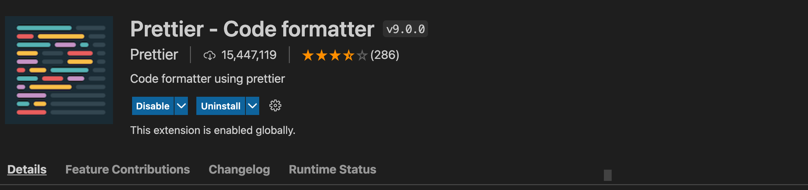
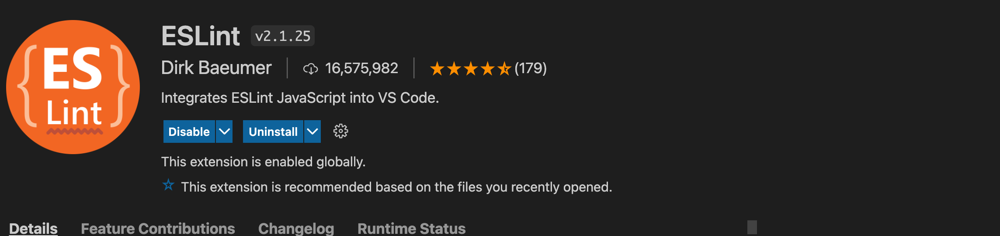

# Application Setup

## Frontend

The frontend portion of this app is built in react. If you do not need to interact with the DB, then this section is all you will need for setup.

This project was bootstrapped with [Create React App](https://github.com/facebook/create-react-app).

### `npm start`

Runs the app in the development mode.
Open [http://localhost:3000](http://localhost:3000) to view it in the browser.

### ESLint 

Something to note is the app will not compile if there are lint errors.

### Useful VSCode extensions

- prettier code formatter
 
 
 
- ESLint

 

## Backend

The backend portion is built using [AWS Amplify Framework](https://docs.amplify.aws/).

Go [here](../amplify/index.md) for setting up amplify.
